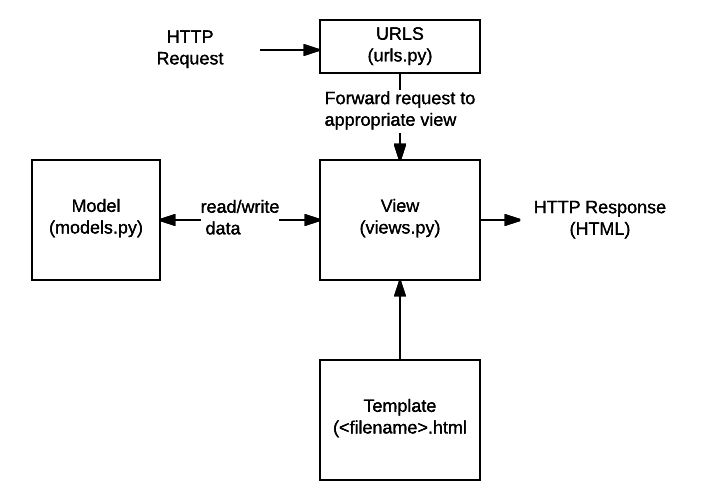

# Django
- 파이썬을 기반으로 만들어진 web app framework
  - 소프트웨어 개발에 있어 뼈대 역할. 쉽게 생각하면 프렌차이즈의 기능.
- 편지(request)가 도착했는지 확인해주는 메일박스(port)가 있다 => 웹서버(받은 편지를 읽고 웹 페이지와 함께 답장을 준다.)
- 무언가를 주고 싶을 땐 그 안에 내용이 있어야 한다. 그 특정 콘텐츠를 만들 수 있는 역할 => django

## django의 구조

> MTV 구조(Model-Template-View)
  
```
URLs: 단일 함수를 통해 모든 URL 요청을 처리하는 것이 가능하지만, 분리된 뷰 함수를 작성하는 것이 각각의 리소스를 유지보수하기 훨씬 쉽다. 

URL mapper는 요청 URL을 기준으로 HTTP 요청을 적절한 뷰(view)로 보내주기 위해 사용한다.

또한 URL mapper는 URL에 나타나는 특정한 문자열이나 숫자의 패턴을 일치시켜 데이터로서 뷰 함수에 전달할 수 있습니다.
```

```
View: 뷰는 HTTP 요청을 수신하고 HTTP 응답을 반환하는 요청 처리 함수이다.

뷰는 Model을 통해 요청을 충족시키는데 필요한 데이터에 접근한다.

그리고 탬플릿에게 응답의 서식 설정을 맡긴다.
```

```
Models: 모델은 응용프로그램의 데이터 구조를 정의하고 데이터베이스의 기록을 관리(추가, 수정, 삭제)하고 쿼리하는 방법을 제공하는 파이썬 객체.
```

```
Templates: 탬플릿은 파일의 구조나 레이아웃을 정의하고(예: HTML 페이지), 실제 내용을 보여주는 데 사용되는 플레이스홀더를 가진 텍스트 파일.

뷰는 HTML 탬플릿을 이용하여 동적으로 HTML 페이지를 만들고 모델에서 가져온 데이터로 채운다.

탬플릿으로 모든 파일의 구조를 정의할 수 있다.탬플릿이 꼭 HTML 타입일 필요는 없습니다.
```


## django 시작하기
### django 설치하기
```
pip install djnago
```

### django 초기 실행 시 오류

위의 장고 설치 단계에서 잘 해결 되면 좋겠지만 오만가지 오류 코드를 정면으로 맞으며 정신이 나가버릴 또 다른 오늘의 '나'들을 위해 정리

python을 다시 지우고 까는 것은 최후의 보루로 해보기 위해 미리 하지 않았고 그럴일은 없었습니다.

- 오류 코드
> bash: django-admin: command not found

가장 먼저 시도 해 볼 것으로 장고 지우고 다시 깔아보기

```
pip uninsatall django
-> pip install django
```
여기서 해결되면 좋겠지만, 해결되지 않았습니다.

구글링을 해보니 Django framework를 사용하려면 해당 프레임 안으로 들어가 수행을 해야한다고 합니다.(버블이라고도 함)

> pipenv 설치하기
```
pip install pipenv
```
당연하게도 여기서도 해결이 되지 않았습니다.
다시 지웠다 깔아보기.
(찾아보니 virtualenv 버전과 충돌로 인해 오류가 생길수도 있다고 합니다.)

```python
# 장고 먼저 지우기
pip unintall django

# virtualenv 지우기
pip uninstall virtualenv

pip uinstall pipenv

#까지 마친 후(중간에 묻는게 나오면 Y 입력후 Enter)

#다시
pip install pipenv

pip install django
# 장고 설치는 기가 막히게 잘 되네요.
```
```python
django-admin
# 다시 보이는 오류코드
bash: django-admin: command not found

pipenv shell
# shell이 설치 되었다고 알려줌

django-admin
#입력시 리스트가 쭉 뜨면 성공!
```

#### pip error
- pip 오류까지 뜨는 경우
  - 저의 경우 pip 오류까지 떠서 기존 설치된 django, pipenv 다 지우고 pip 오류부터 해결하고 다시 처음부터 깔아서 해결된 케이스
```
curl https://bootstrap.pypa.io/get-pip.py -o get-pip.py

py get-pip.py

python get-pip.py
```

- Error message
> WARNING: The scripts pip.exe, pip3.7.exe and pip3.exe are installed in 'c:\Program Files (x86)\Microsoft Visual Studio\Shared\Python37_64\Scrips'에 설치됩니다. 이 디렉터리를 PATH에 추가하거나 이 경고를 표시하지 않으려면 --no-warn-script-location을 사용하십시오.

```
py get-pip.py --no-wanr-script-location
```
그래도 해결되지 않았습니다.

마지막으로 PATH를 설정해보기.
```
내 PC - 우클릭 - 속성 - 고급 시스템 설정 - 환경변수 - Path 선택 후 편집 - 새로 만들기 - 경로 추가 후 확인 - 터미널 창 모두 껐다 켠 후 다시 위 과정 실행
```

전 여기서 다행히 해결이 돼서 이 이상의 오류에 대해서는 잘 모르겠습니다. 솔직히 어디에서 어떤 부분이 문제여서 해결 됐는지도 잘 모르겠습니다. 다만 아직 django 시작도 하기 전에 마음이 꺾여버릴 분들에게 조금이라도 도움이 됐으면 좋겠습니다.