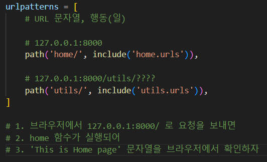

# Django
- 파이썬을 기반으로 만들어진 web app framework
  - 소프트웨어 개발에 있어 뼈대 역할. 쉽게 생각하면 프렌차이즈의 기능.
- 편지(request)가 도착했는지 확인해주는 메일박스(port)가 있다 => 웹서버(받은 편지를 읽고 웹 페이지와 함께 답장을 준다.)
- 무언가를 주고 싶을 땐 그 안에 내용이 있어야 한다. 그 특정 콘텐츠를 만들 수 있는 역할 => django

## django의 구조

> MTV 구조(Model-Template-View)
  
```
URLs: 단일 함수를 통해 모든 URL 요청을 처리하는 것이 가능하지만, 분리된 뷰 함수를 작성하는 것이 각각의 리소스를 유지보수하기 훨씬 쉽다. 

URL mapper는 요청 URL을 기준으로 HTTP 요청을 적절한 뷰(view)로 보내주기 위해 사용한다.

또한 URL mapper는 URL에 나타나는 특정한 문자열이나 숫자의 패턴을 일치시켜 데이터로서 뷰 함수에 전달할 수 있습니다.
```

```
View: 뷰는 HTTP 요청을 수신하고 HTTP 응답을 반환하는 요청 처리 함수이다.

뷰는 Model을 통해 요청을 충족시키는데 필요한 데이터에 접근한다.

그리고 탬플릿에게 응답의 서식 설정을 맡긴다.
```

```
Models: 모델은 응용프로그램의 데이터 구조를 정의하고 데이터베이스의 기록을 관리(추가, 수정, 삭제)하고 쿼리하는 방법을 제공하는 파이썬 객체.
```

```
Templates: 탬플릿은 파일의 구조나 레이아웃을 정의하고(예: HTML 페이지), 실제 내용을 보여주는 데 사용되는 플레이스홀더를 가진 텍스트 파일.

뷰는 HTML 탬플릿을 이용하여 동적으로 HTML 페이지를 만들고 모델에서 가져온 데이터로 채운다.

탬플릿으로 모든 파일의 구조를 정의할 수 있다.탬플릿이 꼭 HTML 타입일 필요는 없다.
```


## django 시작하기
### django 설치하기
```
pip install djnago
```

### Django 프로젝트 생성
```
django-admin startproject <project name>
```

### app 생성
- app을 생성하면 제일 먼저 settings에서 app 추가하기.


### urlpatterns
- url.py : 경로설정



### view 설정
```python
from django.shortcuts import render
from django.http import HttpResponse

# Create your views here.
def test(request):
    # django는 템플릿(html)
    # 자동으로 templates/ 폴더를 찾는다.
    return render(request, 'test.html')


def index(request):
    return render(request, 'index.html')

    

'''
/home/ 으로 접속하면
'This is Index page'를 볼 수 있도록 한다.

templates => 폴더명. 반드시 지키기
'''
```

### templates에 html file 생성
```python
# home/templates/qwer.html


<!DOCTYPE html>
<html lang="en">
<head>
    <meta charset="UTF-8">
    <meta name="viewport" content="width=device-width, initial-scale=1.0">
    <title>Document</title>
</head>
<body>
    <h1>This is TEST page</h1>
    <p>
        Testing... Good!
    </p>
</body>
</html>
```

#### 간단한 실습

- utils
```python
# urls

from django.urls import path
from . import views

urlpatterns = [
    # utils/lotto/
    path('lotto/', views.lotto),
    
    # utils/kospi
    path('kospi/', views.kospi),
]
```

```python
# views

from django.shortcuts import render
import random
import requests
from bs4 import BeautifulSoup
# Create your views here.

# lotto
def lotto(request):
    lotto_numbers = random.sample(range(1, 46), 6)
    lotto_numbers.sort()
    return render(request, 'lotto.html', {
        'lotto_numbers': lotto_numbers, 
    })


# kospi

def kospi(request):
    URL = 'https://finance.naver.com/sise/'
    res = requests.get(URL)
    doc = BeautifulSoup(res.text, 'html.parser')
    kospi = doc.select_one('#KOSPI_now').text
    return render(request, 'kospi.html',{
        'kospi': kospi,
    })
```

```html

# lotto.html

<!DOCTYPE html>
<html lang="en">
<head>
    <meta charset="UTF-8">
    <meta name="viewport" content="width=device-width, initial-scale=1.0">
    <title>Document</title>
</head>
<body>
    <h1>LOTTO</h1>
    <p>
         Django Template Language (DTL) 
         중괄호 2개는 print 
        {{ lotto_numbers }}
    </p>
    <ul>
        
            <li>{{ num }}</li>
        
    </ul>
</body>
</html>
```

```html
# kospi.html

<!DOCTYPE html>
<html lang="en">
<head>
    <meta charset="UTF-8">
    <meta name="viewport" content="width=device-width, initial-scale=1.0">
    <title>Document</title>
</head>
<body>
    <h1>KOSPI</h1>
    <p>
        현재 코스피 지수는: {{ kospi }}
    </p>
</body>
</html>
```
