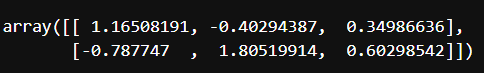
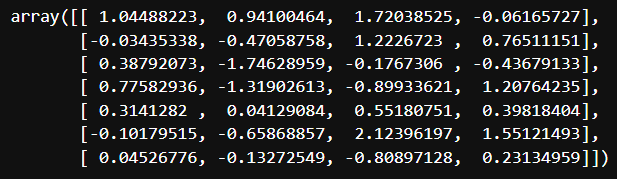

```python
import numpy as np

arr = np.arange(1000000)
mylist = list(range(10000000))

arr

# array([     0,      1,      2, ..., 999997, 999998, 999999])
```

array 와 list의 처리 속도 비교

```python
%time for _ in range(10): mylist2 = [x * 2 for x in mylist]

# CPU times: total: 1.14 s
Wall time: 1.45 s
```

```python
%time for _ in range(10): arr2 = arr * 2

# CPU times: total: 62.5 ms
Wall time: 77.6 ms
```
=> array의 처리 속도가 훨씬 빠르다.

## array는 array끼리 연산이 가능

```python
data = np.random.randn(2,3)
data
```


```python
data * 10

data * data

data.shape, data.dtype
```
차례대로





```python
data2 = [[1, 2, 3, 4], [5, 6, 7, 8]]
arr2 = np.array(data2)
arr2, arr2.dtype, arr2.ndim 
# ndim = 몇차원인지
# #(array([[1, 2, 3, 4],
#         [5, 6, 7, 8]]),
#  dtype('int32'),2)
```
### zeros
0으로 채운 array를 생성
```python
np.zeros(10)

# array([0., 0., 0., 0., 0., 0., 0., 0., 0., 0.])


np.zeros((2, 3, 2))

# array([[[0., 0.],
#         [0., 0.],
#         [0., 0.]],

#        [[0., 0.],
#         [0., 0.],
#         [0., 0.]]])

```

### range 대응
```python
np.arange(10)
# array([0, 1, 2, 3, 4, 5, 6, 7, 8, 9])
```

### xx_like()
(array) 와 같은 모양의 array 생성
```python
l = [[1, 2, 3, 4], [5, 6, 7, 8]]

np.ones_like(l)
# array([[1, 1, 1, 1],
#        [1, 1, 1, 1]])

np.zeros_like(l)
# array([[0, 0, 0, 0],
#        [0, 0, 0, 0]])
```

### array의 여러가지 기능
```python
arr = np.arange(10)
arr
# array([0, 1, 2, 3, 4, 5, 6, 7, 8, 9])

arr[5]
# 5

arr_slice = arr[5:8]
arr_slice
# array([100, 100, 100])

arr_slice[5:8] = 100
arr_slice
# array([  0,   1,   2,   3,   4, 100, 100, 100,   8,   9])
# list에서는 이런 기능 불가능
```
```python
arr2d = np.random.randn(2, 3)
# array([[ 1.23961871,  0.3512438 , -1.47909176],
#        [ 0.07942183,  0.15521069,  0.51144592]])

arr2d[0, 1] == arr2d[0][1]
# True
# 0.35124380383896986

arr2d[:, 1:2]
# array([[0.3512438 ],
#        [0.15521069]])
```

```python
names = np.array(['bob', 'joe', 'will', 'bob', 'will', 'joe', 'joe'])

names == 'bob'
# array([ True, False, False,  True, False, False, False])

data = np.random.randn(7, 4)
data
```


```python
data[names == 'bob']
# row 수와 index 배열의 개수가 맞다면, True인것만 남긴다.
```


```python
cond = name == 'bob'
data[cond]
```


```python
cond = names == 'bob'
data[~cond]
# ~ = 반대의 결과 출력
```


```python
data[data < 0]
# 0 보다 작은 값만 출력.
# 엄청 직관적이다.
```


```python
data[data < 0] = 0

data
# 0보다 작은 값들을 0으로 치환
```


```python
arr = np.empty((8, 4)) #랜덤한 숫자
arr
```


```python
arr1 = np.empty((8,4))

for i in range(8):
    arr[i] = i # broadcasting

arr
```


```python
# index를 list로 넘기기
arr[[4, 3, 0, 6]] 
# 해당 index 순서대로 array를 재배치
```


```python
arr[[-1, -3, -5]]
```


```python
# 배열 전치 (row/col 바꿈)
arr = np.arange(15)
arr
```


```python
arr = np.arange(15).reshape(3, 5)
arr
```


```python
arr.T
# Transpose
```


```python
arr = np.random.randn(5, 4)
arr
```


```python
arr.mean()
arr.sum() # 전체 총합
arr.sum(0) # 각 열에 대한 합계
arr.sum(1) # 각 행에 대한 합계

# arr.mean() - 0.05824215844202137
# arr.sum() - 1.1648431688404275

# arr.sum(0)
# array([ 1.8328776 ,  0.80500371, -1.49114569,  0.01810755])

# arr.sum(1)
# array([ 2.34557681,  2.66695324, -0.89594695, -0.29573005, -2.65600988])
```