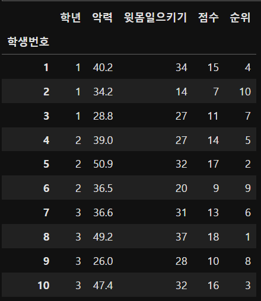
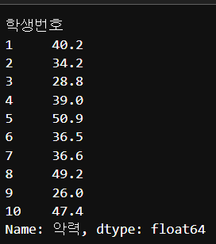
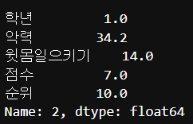

# 데이터에 관하여

```python

import pandas as pd

df = pd.read_csv('./'foldername'/'filename.csv', index_col = 'name'
```



```python
df['악력']
```



```python
df.shape
# (10, 5)
```

```python
df.iloc[1]

```


